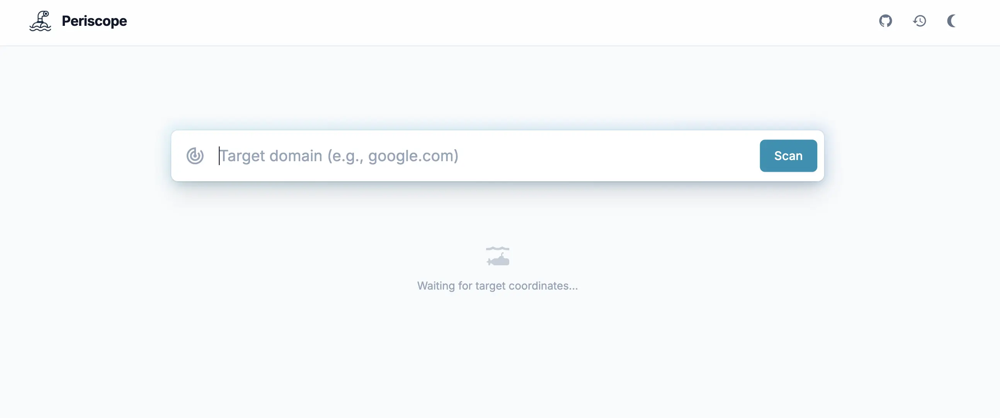
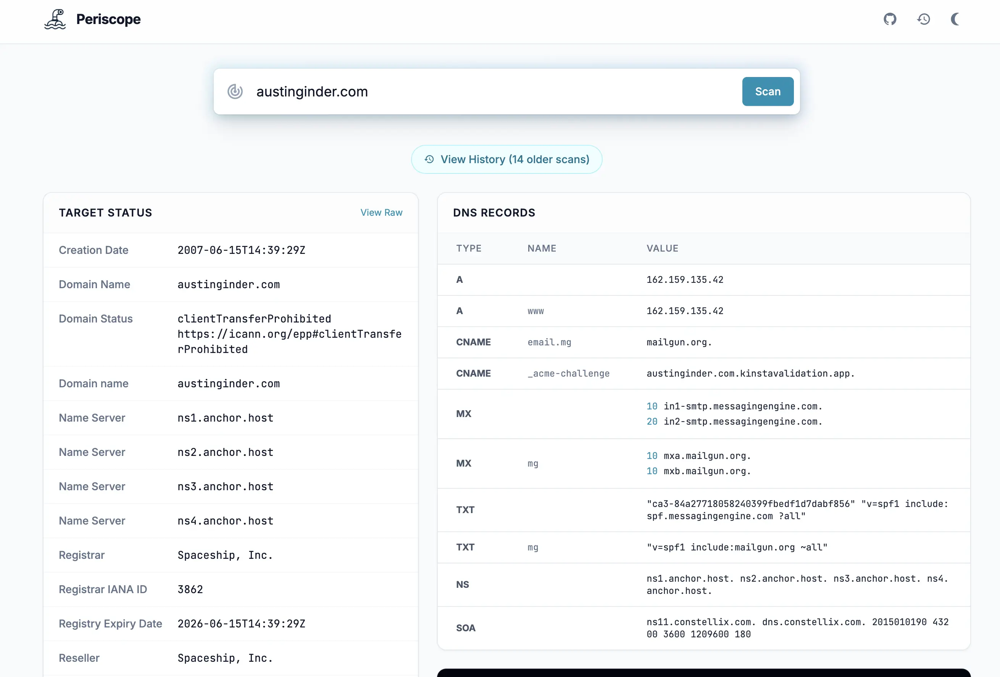
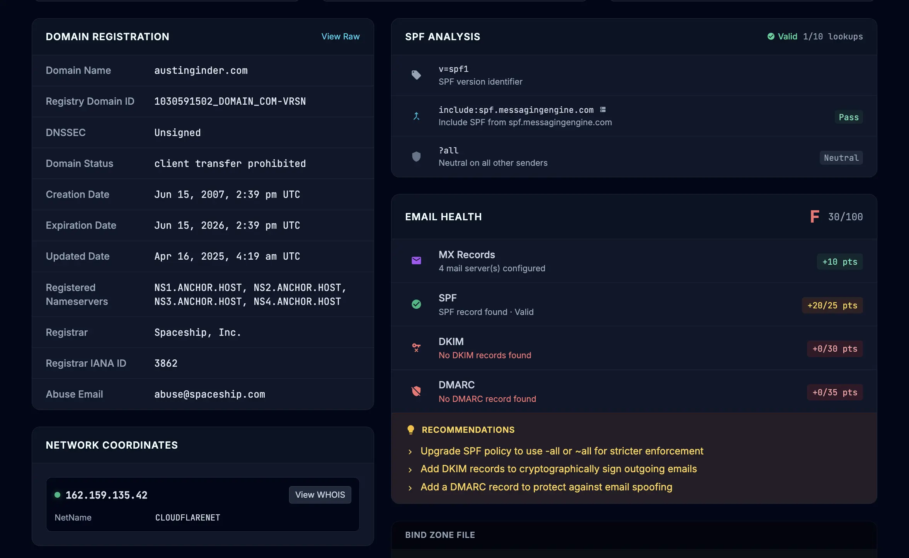
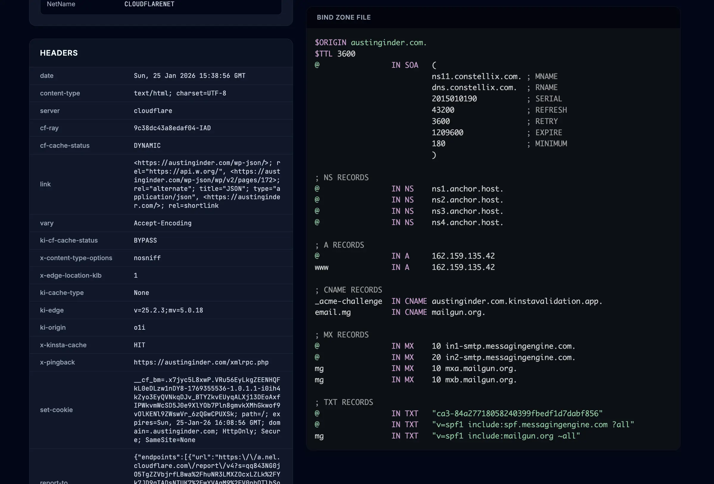

# Periscope 🔭

**Peer into any domain.**

Periscope is a sophisticated DNS and Network diagnostic tool. It combines a beautiful web interface [https://periscope.run](https://periscope.run) with a **Local Bridge** running on your machine. This allows the web UI to securely execute local system tools like `dig`, `whois`, and `curl` to gather deep intelligence on domains without rate limits or proxy restrictions.



## 🚀 Quick Start

To start Periscope, simply run the bootstrapper. This will set up the environment, start the local bridge, and open the interface in your browser.

```bash
curl -sL https://periscope.run/boot.sh | bash
```

*This command installs necessary dependencies (PHP, dig, whois) if missing, sets up the local API engine, and connects it to the web UI.*

## ✨ Features

* **Email Health Grading:** Automatic scoring (A-F) of email infrastructure security. Analyzes MX redundancy, SPF strictness, DKIM presence, and DMARC policies with actionable recommendations.
* **SPF Visualizer:** Visualizes SPF record structure, identifies third-party providers, and counts DNS lookups against the RFC limit of 10.
* **Portable Reports:** Export full domain scans as standalone, single-file HTML reports—perfect for sharing with clients or archiving.
* **Deep DNS Scanning:** Checks A, AAAA, MX, NS, SOA, TXT, SRV, CNAME, CAA, HTTPS, SVCB, and TLSA records.
* **Intelligent Analysis:** Automatically flattens CNAME chains and detects modern email security standards (MTA-STS, BIMI, DKIM).
* **Zone File Generation:** Exports discovered records into a valid BIND Zone file.
* **Network Coordinates:** Resolves IP addresses to their hosting providers/organizations with Reverse DNS (PTR) verification.
* **SSL Certificate Info:** Displays expiration date, days remaining, and certificate issuer.
* **Security Headers:** Analyzes and scores headers including HSTS, CSP, X-Frame-Options, and Permissions-Policy.
* **CMS/Platform Detection:** Identifies WordPress (including Plugins/Themes), Shopify, Squarespace, Wix, Drupal, Joomla, Webflow, and Ghost.
* **Technology Detection:** Detects JavaScript frameworks (React, Vue, Next.js, Alpine.js), analytics, e-commerce platforms, and CSS frameworks (Tailwind).
* **Infrastructure Detection:** Detects 35+ hosting providers and 15+ CDNs via HTTP header fingerprinting.
* **Metadata Analysis:** Checks robots.txt, sitemap.xml, security.txt, Open Graph tags, and favicon hashes.
* **History & Snapshots:** Uses a hybrid storage engine (SQLite + flat files) to save every lookup. Compare current DNS states against previous versions.
* **Deep Linking:** Link directly to domain scans via URL parameters.
* **CLI Mode:** Run quick diagnostics directly from your terminal.

## ⌨️ Keyboard Shortcuts

| Shortcut | Action |
| --- | --- |
| `/` | Focus search bar |
| `?` | Show help modal |
| `Cmd` + `K` | Open scan history |
| `Esc` | Close modal |
| `↑` / `↓` | Navigate lists |
| `Enter` | Select item |

*Right-click on IP addresses or Domain values in the UI to access context menus for "Dig" and "Whois".*

## 📡 DNS Records Scanned

### Core Record Types

| Type | Name | Description |
| --- | --- | --- |
| `A` | `@`, `*`, `www`, + subdomains | IPv4 addresses |
| `AAAA` | `@`, `www` | IPv6 addresses |
| `NS` | `@` | Nameservers |
| `SOA` | `@` | Start of Authority |
| `MX` | `@`, `mg` | Mail exchangers |
| `TXT` | `@` | Text records (SPF, verification, etc.) |
| `CAA` | `@` | Certificate Authority Authorization |
| `HTTPS` | `@` | HTTPS service binding |
| `SVCB` | `@` | Service binding |
| `TLSA` | `_443._tcp`, `_25._tcp` | DANE TLS authentication |
| `SRV` | Various | Service records |
| `CNAME` | Various | Canonical name aliases |

### Subdomains Scanned

| Category | Subdomains |
| --- | --- |
| **Web** | `www`, `blog`, `shop`, `portal`, `cdn`, `status` |
| **Email** | `mail`, `webmail`, `smtp`, `imap` |
| **Hosting Panels** | `cpanel`, `whm`, `plesk` |
| **Development** | `dev`, `api`, `app`, `staging`, `stage`, `test`, `testing`, `uat`, `demo`, `beta`, `alpha`, `sandbox` |
| **DevOps** | `git`, `gitlab`, `jenkins`, `ci` |
| **Admin/Auth** | `admin`, `administrator`, `dashboard`, `panel`, `login`, `signin`, `auth`, `sso`, `oauth`, `secure`, `ssl` |
| **Assets** | `static`, `assets`, `img`, `images`, `media`, `files`, `downloads` |
| **Documentation** | `docs`, `documentation`, `support`, `help`, `kb` |
| **Network** | `remote`, `vpn`, `ftp`, `gateway`, `proxy`, `internal`, `intranet` |

### Email Authentication

| Record | Name | Purpose |
| --- | --- | --- |
| SPF | `@` TXT | Sender Policy Framework |
| DMARC | `_dmarc` | Domain-based Message Authentication |
| MTA-STS | `_mta-sts`, `mta-sts` | Mail Transfer Agent Strict Transport Security |
| TLS-RPT | `_smtp._tls` | TLS Reporting |
| BIMI | `default._bimi` | Brand Indicators for Message Identification |

### DKIM Selectors

| Selector | Service |
| --- | --- |
| `google._domainkey` | Google Workspace |
| `selector1._domainkey`, `selector2._domainkey` | Microsoft 365 |
| `default._domainkey` | Generic |
| `k1._domainkey`, `k2._domainkey`, `k3._domainkey` | Mailchimp |
| `s1._domainkey`, `s2._domainkey` | Generic |
| `mandrill._domainkey` | Mailchimp/Mandrill |
| `mxvault._domainkey` | MXVault |
| `postmark._domainkey`, `pm._domainkey` | Postmark |
| `mailjet._domainkey` | Mailjet |
| `sendgrid._domainkey`, `smtpapi._domainkey` | SendGrid |
| `amazonses._domainkey` | Amazon SES |
| `sparkpost._domainkey` | SparkPost |
| `cm._domainkey` | Campaign Monitor |
| `mailgun._domainkey` | Mailgun |
| `zendesk1._domainkey`, `zendesk2._domainkey` | Zendesk |
| `krs._domainkey` | Kustomer |
| `protonmail._domainkey` (1-3) | ProtonMail |
| `zmail._domainkey`, `zoho._domainkey` | Zoho |

### Microsoft 365 / Office 365

| Type | Name | Purpose |
| --- | --- | --- |
| CNAME | `autodiscover` | Outlook autodiscovery |
| CNAME | `lyncdiscover` | Skype for Business |
| CNAME | `sip` | SIP federation |
| CNAME | `enterpriseregistration` | Device registration |
| CNAME | `enterpriseenrollment` | MDM enrollment |
| CNAME | `msoid` | Microsoft Online ID |
| SRV | `_sip._tls` | SIP over TLS |
| SRV | `_sipfederationtls._tcp` | SIP federation |
| SRV | `_autodiscover._tcp` | Autodiscovery |

### Other Records

| Type | Name | Purpose |
| --- | --- | --- |
| TXT | `_amazonses` | Amazon SES verification |
| TXT | `_mailchannels` | MailChannels verification |
| TXT/CNAME | `_acme-challenge` | Let's Encrypt validation |
| TXT | `_google` | Google site verification |
| TXT | `_github-challenge` | GitHub verification |
| TXT | `_facebook` | Facebook verification |
| TXT | `_dnslink` | IPFS/DNSLink |
| MX/CNAME/TXT | `mg.*` | Mailgun subdomain |

## 🏢 Infrastructure Detection

### CDN Providers

| CDN | Detection Method |
| --- | --- |
| Cloudflare | `cf-ray`, `cf-cache-status` headers |
| CloudFront | `x-amz-cf-id`, `x-amz-cf-pop` headers |
| Fastly | `x-served-by` header |
| Akamai | `x-akamai-transformed`, `akamai-grn` headers |
| BunnyCDN | `cdn-pullzone`, `cdn-uid` headers |
| StackPath | `x-hw`, `x-sp-pop` headers |
| Azure CDN | `x-msedge-ref`, `x-azure-ref` headers |
| Google Cloud CDN | `via: google` header |
| Sucuri | `x-sucuri-id` header |
| Imperva | `x-iinfo` header |
| KeyCDN | `x-edge-location` header |
| ArvanCloud | `x-arvan-cache` header |
| CDN77 | `x-77-pop`, `x-cdn77-pop` headers |
| Limelight | `x-llnw-nginx` header |
| Edgecast | `x-ec-custom-error` header |
| Cachefly | `x-cf-pop` header |

### Hosting Providers

| Provider | Detection Method |
| --- | --- |
| Kinsta | `x-kinsta-cache`, `ki-cf-cache-status` headers |
| WP Engine | `x-powered-by: WP Engine` header |
| Flywheel | `x-fw-hash`, `x-fw-serve` headers |
| Pantheon | `x-pantheon-styx-hostname` header |
| Vercel | `x-vercel-id`, `x-vercel-cache` headers |
| Netlify | `x-nf-request-id` header |
| Heroku | `via: heroku` header |
| AWS | `x-amzn-requestid`, `x-amz-request-id` headers |
| Google Cloud | `x-cloud-trace-context` header |
| Azure | `x-ms-request-id`, `arr-disable-session-affinity` headers |
| DigitalOcean | `x-do-app-origin` header |
| Render | `x-render-origin-server`, `rndr-id` headers |
| Railway | `x-railway-request-id` header |
| Fly.io | `fly-request-id` header |
| Platform.sh | `x-platform-server` header |
| Acquia | `x-ah-environment`, `x-acquia-host` headers |
| Pagely | `x-pagely-cache` header |
| Pressable | `x-powered-by: flavor atlas` header |
| SiteGround | `x-siteground-optimizer` header |
| Rocket.net | `x-rocket-cache-status` header |
| Convesio | `x-convesio-cache` header |
| Cloudways | `x-cw-cache`, `x-cloudways-cache` headers |
| Liquid Web | `x-lw-cache` header |
| 10Web | `x-10web-cache` header |
| Bluehost | `x-endurance-cache-level` header |
| GoDaddy | `x-godaddy-datacenter` header |
| DreamHost | `x-served-by: dreamhost` header |
| WPX | `x-wpx-cache` header |
| Closte | `x-closte-cache` header |
| Templ | `x-templ-cache` header |
| Servebolt | `x-servebolt-id` header |
| SpinupWP | `x-spinupwp-cache` header |
| GridPane | `x-gridpane-cache` header |
| RunCloud | `x-runcloud-cache` header |
| WordPress.com | `x-ac`, `via: wordpress.com` headers |
| Squarespace | `server: Squarespace` header |
| Wix | `server: Pepyaka` header |
| Shopify | `x-shopify-stage`, `x-shopid` headers |
| GitHub Pages | `x-github-request-id` header |
| GitLab Pages | `x-gitlab-version` header |
| Webflow | `x-wf-proxy-request-id` header |
| Deno Deploy | `x-deno-ray` header |
| Cloudflare Pages | `cf-ray` + `server: cloudflare` headers |

### Web Servers

| Server | Detection |
| --- | --- |
| nginx | `server: nginx` |
| Apache | `server: Apache` |
| LiteSpeed | `server: LiteSpeed` |
| IIS | `server: Microsoft-IIS` |
| OpenResty | `server: openresty` |
| Caddy | `server: Caddy` |
| Tengine | `server: Tengine` |
| Cowboy | `server: Cowboy` |

### CMS/Platform Detection

| Platform | Detection Method |
| --- | --- |
| WordPress | `wp-content`, `wp-includes` in HTML |
| Shopify | `cdn.shopify.com` in HTML |
| Squarespace | `squarespace.com` in HTML |
| Wix | `wix.com`, `wixstatic.com` in HTML |
| Drupal | `Drupal.settings`, `/sites/default/` in HTML |
| Joomla | `generator: Joomla` meta tag |
| Webflow | `webflow.com` in HTML |
| Ghost | `ghost.io` in HTML |

## 🔒 Security Headers

Periscope checks for the presence and configuration of important security headers, providing a score out of 7.

| Header | Description |
| --- | --- |
| `Strict-Transport-Security` | HSTS - enforces HTTPS connections |
| `Content-Security-Policy` | CSP - prevents XSS and injection attacks |
| `X-Frame-Options` | Prevents clickjacking attacks |
| `X-Content-Type-Options` | Prevents MIME-type sniffing |
| `Referrer-Policy` | Controls referrer information |
| `Permissions-Policy` | Controls browser features (formerly Feature-Policy) |
| `X-XSS-Protection` | Legacy XSS filter (for older browsers) |

Additionally, Periscope checks for:

* `/.well-known/security.txt` - Security contact information
* `/security.txt` - Fallback location

## 💻 Technology Detection

### JavaScript & CSS Frameworks

| Framework | Detection Pattern |
| --- | --- |
| React | `reactdom`, `__REACT`, `_reactRootContainer` |
| Vue.js | `__VUE__`, `v-cloak`, `v-if`, `v-for` |
| Angular | `ng-app`, `ng-controller` |
| Next.js | `_next/static`, `__NEXT_DATA__` |
| Nuxt.js | `_nuxt/`, `__NUXT__` |
| Gatsby | `gatsby-` prefixed classes |
| Svelte | `__svelte` |
| Ember.js | `ember-view`, `data-ember` |
| jQuery | `jquery.min.js`, `jquery.js` |
| Alpine.js | `x-data`, `x-show`, `x-bind` |
| Tailwind CSS | `tailwindcss` references |
| Bootstrap | `bootstrap.min.css`, `bootstrap.bundle` |

### Analytics Platforms

| Platform | Detection Pattern |
| --- | --- |
| Google Analytics | `google-analytics.com`, `gtag(`, `UA-*`, `G-*` |
| Plausible | `plausible.io` |
| Fathom | `usefathom.com` |
| Matomo | `matomo.js`, `piwik.js` |
| Hotjar | `hotjar.com` |
| Mixpanel | `mixpanel.com` |
| Segment | `segment.com`, `analytics.load` |
| Heap | `heap.io` |
| Amplitude | `amplitude.com` |
| Microsoft Clarity | `clarity.ms` |
| Facebook Pixel | `fbevents`, `fbq(` |
| LinkedIn Insight | `snap.licdn.com` |
| Twitter Pixel | `ads-twitter.com`, `twq(` |

### E-commerce Platforms

| Platform | Detection Pattern |
| --- | --- |
| WooCommerce | `woocommerce`, `wc-block` |
| Magento | `Mage.Cookies`, `mage-` |
| BigCommerce | `bigcommerce.com` |
| PrestaShop | `prestashop` |
| OpenCart | `opencart` |
| Ecwid | `ecwid.com` |
| Snipcart | `snipcart` |
| Stripe | `stripe.com`, `Stripe(` |
| PayPal | `paypal.com/sdk` |

### Chat & Support Widgets

| Widget | Detection Pattern |
| --- | --- |
| Intercom | `intercom.io` |
| Drift | `drift.com` |
| Crisp | `crisp.chat` |
| Tawk.to | `tawk.to`, `Tawk_API` |
| LiveChat | `livechat.com` |
| Zendesk | `zendesk.com`, `zE(` |
| Freshdesk | `freshdesk.com` |
| HubSpot | `hubspot.com`, `hs-scripts` |
| Olark | `olark.com` |
| Tidio | `tidio.co` |

### Form & Marketing Tools

| Tool | Detection Pattern |
| --- | --- |
| Typeform | `typeform.com` |
| JotForm | `jotform.com` |
| Google Forms | `forms.gle`, `docs.google.com/forms` |
| Mailchimp | `mailchimp.com` |
| ConvertKit | `convertkit.com` |
| Google Tag Manager | `googletagmanager.com/gtm` |

## 📋 Metadata Detection

### Files Checked

| File | Purpose |
| --- | --- |
| `/robots.txt` | Crawling rules, disallowed paths, sitemap references |
| `/sitemap.xml` | XML sitemap presence and URL count |
| `/.well-known/security.txt` | Security contact and policy info |
| `/favicon.ico` | Favicon presence and MD5 hash (for fingerprinting) |

### Meta Tags Parsed

| Category | Tags |
| --- | --- |
| **Basic** | `title`, `description`, `keywords`, `author`, `generator` |
| **Open Graph** | `og:title`, `og:description`, `og:image`, `og:type` |
| **Twitter Cards** | `twitter:card`, `twitter:site`, `twitter:title` |
| **SEO** | `canonical` link |

### robots.txt Analysis

* Counts `Disallow` rules (potential hidden paths)
* Extracts `Sitemap` references
* Shows first 20 disallowed paths

### Favicon Fingerprinting

The favicon MD5 hash can be used to identify sites using the same favicon, useful for:

* Identifying related sites
* Detecting default CMS favicons
* Tracking site infrastructure changes

## 🛠️ How it Works

Periscope uses a **Local Bridge** architecture:

1. **The Interface:** Hosted at `https://periscope.run`. It provides the visualization and user experience.
2. **The Engine:** A lightweight PHP script running locally on your machine (default port `8989`).
3. **The Connection:** The Interface sends requests to `http://127.0.0.1:8989`. The Engine executes system commands (`dig`, `whois`) and returns structured JSON.

**Data Privacy:** All history and metadata are stored in a local SQLite database (`~/.periscope/history.db`), while heavy raw scan data (HTML, Headers, Images) is stored as flat files in `~/.periscope/scans/`. No scan data is sent to external servers.

## 📦 Manual Installation & Requirements

If you prefer not to use the auto-bootstrapper, you can run Periscope manually.

### Requirements

* **OS:** macOS, Linux, or Windows (via WSL).
* **PHP:** 8.0+ (with `php-curl`, `php-sqlite3`, `php-cli`).
* **Tools:** `dig` (dnsutils/bind), `whois`, `curl`, `unzip`.

### Running from Source

```bash
# 1. Clone the repository
git clone https://github.com/austinginder/periscope.git
cd periscope

# 2. Run the boot script
./boot.sh
```

### Development Mode

For local development, use the `--local` flag. This serves the `index.html` from your local directory instead of downloading from GitHub releases:

```bash
./boot.sh --local
```

This opens `http://127.0.0.1:8989/?local=true` with your local changes.

### Deep Linking

You can link directly to a domain scan using URL parameters:

```
http://127.0.0.1:8989/?local=true&domain=example.com
```

* If the domain exists in history, the cached result is displayed immediately
* If not found, a fresh scan is triggered automatically
* The `local=true` parameter is required for domain lookups to work

## 💻 CLI Usage

Once installed, you can use the underlying engine directly from your terminal for quick, headless scans.

```bash
# Standard lookup
php ~/.periscope/engine.php google.com

# Upgrade scan history to new storage format
php ~/.periscope/engine.php action=bulk_upgrade
```

## 🔄 Versioning & Cache Upgrades

Periscope uses [Semantic Versioning](https://semver.org/) (`MAJOR.MINOR.PATCH`):

- **MAJOR:** Breaking changes
- **MINOR:** New features, scan format changes
- **PATCH:** Bug fixes, minor improvements

### Cache Validity

Cached scan data is considered valid if the **major.minor** version matches. This means:

| Cached Version | Current Version | Cache Valid? | Reason |
| --- | --- | --- | --- |
| 1.4 | 1.4.1 | Yes | Same minor version (1.4) |
| 1.4.1 | 1.4.2 | Yes | Same minor version (1.4) |
| 1.4 | 1.5 | No | Different minor version |
| 1.3 | 1.4 | No | Different minor version |

When loading a cached scan with an outdated version, Periscope automatically regenerates the response data from the stored raw files (HTML, headers, DNS records, etc.) using the current engine logic.

### Bulk Upgrade

To upgrade all historical scans to the current version:

```bash
php ~/.periscope/engine.php action=bulk_upgrade
```

This reprocesses scans that have raw files available, applying any new detection logic or data transformations from newer versions.

## 📸 Screenshots

Website Overview



Domain, SPF Analysis and Email Health



DNS Records



## 🤝 Contributing

Periscope is open source. Pull requests are welcome for new DNS record types, UI improvements, or better OS compatibility for the bootstrapper.

## License

MIT