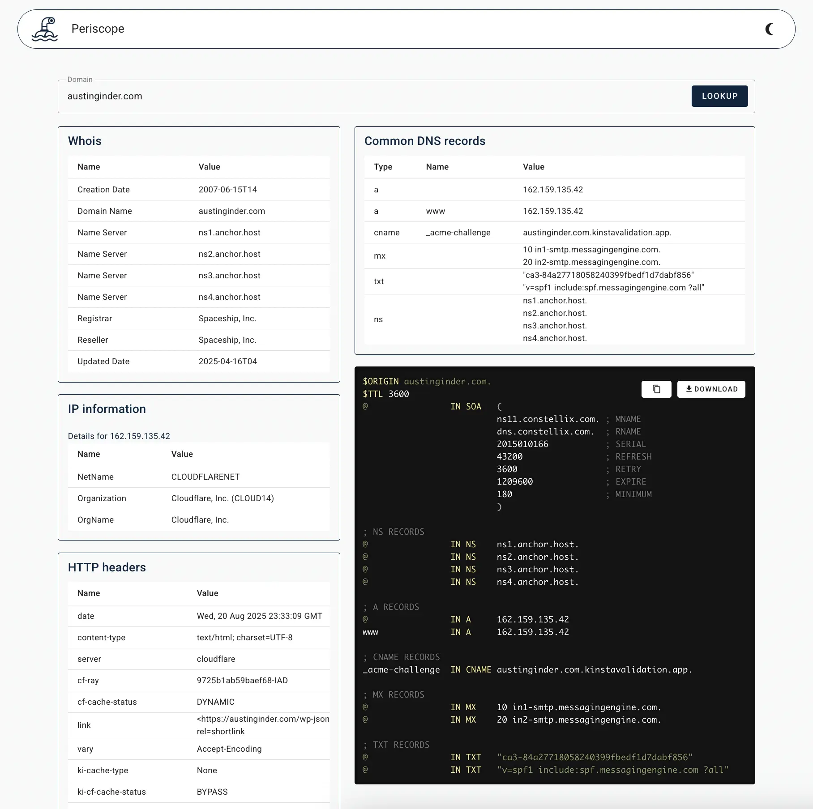

# Periscope

Peer into any domain.

A single-file `.php` script to fetch domain information from `whois` and `dig`. It supports exporting discovered records as a DNS zone file.

## Requirements

  - PHP
  - `shell_exec` enabled
  - The following command-line tools: `whois`, `dig`, `host`, `curl`

## Running Locally

You can run this on a local machine or any web server that supports PHP and `shell_exec`.

```bash
# Clone the repository
git clone https://github.com/austinginder/periscope.git

# Navigate into the directory
cd periscope

# Start the local PHP server
php -S localhost:8000
```

Then open `http://localhost:8000` in your browser.

